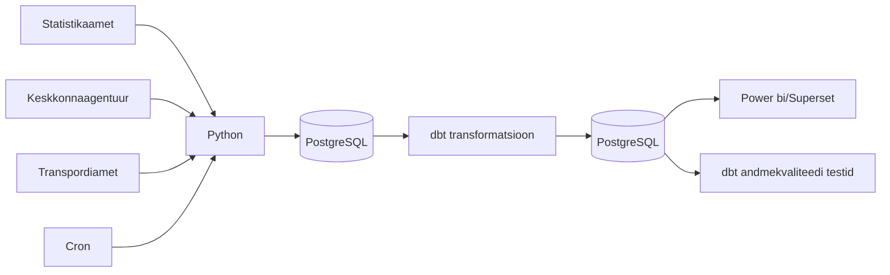

# Ilmastikutingimuste mõju surmajuhtumitele ja liiklusõnnetustele Eestis — Marta Bogatõr, Mark Robin Kalder, Heti Pisarev, Inge Ringmets

## Äriküsimus

Eesmärk on uurida, kas ja kuidas on ilm (temperatuur, sademed ja tuul) seotud surmajuhtude ja liiklusõnnetuste arvuga. Näiteks kas väga kuumade või väga külmade ilmadega on rohkem surmajuhte ja/või liiklusõnnetusi. Surmajuhtumeid saab analüüsida ka vanuserühmiti, liiklusõnnetusi maakonniti või piirkonniti.
Ilma "mõju" hindamiseks võrreldakse erinevate ilmastikutingimustega nädalaid. Vajadusel kasutatakse võrdlusperioodina varasemate aastate sama nädala keskmisi näitajaid.
Analüüs ei otsi ega tõesta põhjuslikke seoseid, vaid kirjeldab statistilisi seoseid ilmastikunäitajate, surmajuhtude ja liiklusõnnetuste vahel.

**Mõõdikud:**

1. Nädala keskmine temperatuur, päikesepaiste hulk + Ööpäeva keskmine temperatuur
  päikesepaiste kestus, grupeeritud aasta + nädal järgi
2. Äärmuslikud ilmastikutingimused
  Väga kuum päev = päev, mil maksimaalne temperatuur on üle 30°C
  Väga külm päev = päev, mil keskmine või minimaalne temperatuur jääb alla valitud lävendi, näiteks -10°C
3. Liiklusõnnetuste arv, vigastatute ja hukkunute arv ööpäevas maakondade lõikes
  liiklusõnnetus(valida gruppi), grupeeritud kuupäev + maakond järgi
4. Surmajuhtude arv nädalas - päevas surnud inimeste arvu summa kokku ühes nädalas, vanuserühmiti ja maakonniti või piirkonniti

## Arhitektuur



Täpsem kirjeldus: [`Docs/Arhitektuur.md`](docs/arhitektuur.md)


## Tööriistad

| Komponent | Tööriist |
|-----------|---------|
| Sissevõtt | [Python] |
| Orkestreerimine | [CRON] |
| Transformatsioon | [SQL / dbt] |
| Andmehoidla | PostgreSQL |
| Näidikulaud | [Superset] |

## Andmevoog lühidalt

1. **Sissevõtt** — [Kirjelda, kuidas andmed allikast kätte saadakse]

**Liikluse andmed**
Skript _download_liiklus.py_ pärib Maanteeameti liiklusõnnetuste API-st värsked liiklusõnnetuste kirjed. [Liiklusõnnetused](https://andmed.eesti.ee/datasets/inimkannatanutega-liiklusonnetuste-andmed)
Saadud JSON andmed teisendatakse ridade kaupa ning kirjutatakse PostgreSQL tabelisse .
Skript tagab, et uued andmed lisatakse olemasolevatele, vältides duplikaate.

**Surmad**
Skript _download_surm.py_ laeb alla Statistikaameti API-st surmade statistika (vanus, sugu, põhjus).[Surmad](https://andmed.stat.ee/et/stat/rahvastik__rahvastikusundmused__surmad/RV035/table/tableViewLayout2)
Andmed puhastatakse ja normaliseeritakse ning seejärel salvestatakse PostgreSQL andmebaasi tabelisse mortality.
Skript on osa automaatsest ETL protsessist, mis tagab, et surmaandmed on alati ajakohased.

**Ilma andmed**
Skript _download_ilm.py_ laadib alla Eesti Ilmateenistuse API-st ilmaandmed (temperatuur, sademed, tuul) JSON-formaadis. [Ilmastikunähtused](https://keskkonnaportaal.ee/et/avaandmed/keskkonna-ja-ilma-valdkonna-andmeteenused)
Andmed parsitakse sobivasse struktuuri ja salvestatakse PostgreSQL andmebaasi tabelisse, kasutades SQL INSERT käske.
Skript käivitub automaatselt pipeline’i osana ja uuendab andmeid perioodiliselt.


3. **Laadimine** — Andmed laaditakse `staging` kihti
4. **Transformatsioon** — [Kirjelda peamised arvutused ja mudelid]
  - liiklusõnnetuste andmed "onnetused" -- tuleb õnnetuste kuupäevad jagada nädalateks ja lugeda iga aasta ja nädala kohta kokku liiklusõnnetuste arv, hukkunute arv ja vigastatute arv    
  - surmade andmed "surmad" -- alles jäävad read, kus "Näitaja" = 'Surmade arv' & "Nädalad" <> 'Nädalad kokku'. Sin tuleb tähele panna et need nädalad aastal 2026, mis pole veel kätte jäudnud on tabelis olemas, aga sisaldavad NaN ja teevad summeerimise sassi.
    
  - ilma andmed "ilm" -- veerus "element_nimi_eng" tuleb välja korjata meile meelepärased näitajad ja ajada õigete ajavahemike järgi kokku.  Seal on olemas  Air pressure at sea level (daily avg),  Air temperature (daily avg),  Air temperature (daily max),  Air temperature (daily min),  Global radiation (daily sum),  Precipitation (daily sum),  Relative humidity (daily avg),  Snow depth (at 06:00UTC),  Sunshine duration (daily sum),  Wind gust (daily max),  Wind speed (daily avg). Saame mõelda, mida täoselt vaja.
  
5. **Testimine** — [Mitu] andmekvaliteedi testi kontrollivad korrektsust
6. **Näidikulaud** — [Kirjelda lühidalt, mida näidikulaud näitab]

## Projekti struktuur

```
.
├── README.md
├── compose.yml
├── .dockerignore
├── .env.example
├── .gitignore
├── dbt_project.yml
├── profiles.yml
├── dbt-requirements.txt
├── docker/
│   └── dbt.Dockerfile
├── macros/
├── models/
│   ├── staging/
│   ├── intermediate/
│   └── marts/
├── orchestrator/
│   ├── crontab
│   ├── Dockerfile
│   ├── orchkestrator.py
│   └── run.sh
├── seeds/
├── docs/
│   ├── arhitektuur.md      ← nädal 1 väljund
│   └── progress.md         ← nädal 2 väljund
└── scripts/
│   ├── Dockerfile
│   ├── download_ilm.py
│   ├── download_liiklus.py
│   ├── download_surm.py
│   ├── entrypoint.sh
│   └── requirements.txt


```

## Sissevõtt

| Andmebaasi tabeli nimi | Allikas | Tüüp | Allika uuenemise sagedus | Link |
|-------------|---------|-------|--------------|------|
| surmad | Statistikaamet RV035 - sisaldab **surmade arve** aasta, nädala, vanuserühma (0-64, 65-79, 80+) | json | kord nädalas | [Surmad](https://andmed.stat.ee/et/stat/rahvastik__rahvastikusundmused__surmad/RV035/table/tableViewLayout2) |
| ilm | Keskkonnaportaal - sisaldab **ilmamõõtmisi** Eestis tunni ja jaama kaupa | json | kord tunnis | [Ilmastikunähtused](https://keskkonnaportaal.ee/et/avaandmed/keskkonna-ja-ilma-valdkonna-andmeteenused) |
| onnetused | Transpordiamet - sisaldab **liiklusõnnetusi**, nendes vigastatute ja hukkunute arvu maakonniti | csv | kord nädalas | [Liiklusõnnetused](https://andmed.eesti.ee/datasets/inimkannatanutega-liiklusonnetuste-andmed) |

**Liikluse andmed**
Skript _download_liiklus.py_ pärib Maanteeameti liiklusõnnetuste API-st värsked liiklusõnnetuste kirjed.
Saadud JSON andmed teisendatakse ridade kaupa ning kirjutatakse PostgreSQL tabelisse .
Skript tagab, et uued andmed lisatakse olemasolevatele, vältides duplikaate.

**Surmad**
Skript _download_surm.py_ laeb alla Statistikaameti API-st surmade statistika (vanus, sugu, põhjus).
Andmed puhastatakse ja normaliseeritakse ning seejärel salvestatakse PostgreSQL andmebaasi tabelisse mortality.
Skript on osa automaatsest ETL protsessist, mis tagab, et surmaandmed on alati ajakohased.

**Ilma andmed**
Skript _download_ilm.py_ laadib alla Eesti Ilmateenistuse API-st ilmaandmed (temperatuur, sademed, tuul) JSON-formaadis.
Andmed parsitakse sobivasse struktuuri ja salvestatakse PostgreSQL andmebaasi tabelisse, kasutades SQL INSERT käske.
Skript käivitub automaatselt pipeline’i osana ja uuendab andmeid perioodiliselt.


## Käivitamine

```bash
# 1. Klooni repo ja liigu kausta
git clone https://github.com/MarthaBog/Data-engineer-project-TU
cd Data-engineer-project-TU

# 2. Kopeeri keskkonnamuutujad
cp .env.example .env

# 3. Käivita teenused (käivitab korraga ka transformatsioonid ja loob superseti jaoks sisendi)
docker compose up -d --build

(Käsitsi dbt transformatsioonide käivitamine-- pole eraldi vaja teha)
docker compose --profile dbt run --rm dbt seed
docker compose --profile dbt run --rm dbt run

# 4. Superseti avamiseks
Superset link (parool failis ".env")
http://localhost:8088

Supersetis avada:
**Settings → Database Connections → Ilm Surm Liiklus PostgreSQL → Edit**

Sisesta SQLAlchemy URI:
**postgresql://projekt:pass@db:5432/ilm_surm_liiklus**

Import dashboard:
Dashboards → Import → lisada zip-file kaustast "superset_exports"
```


## Saladused ja konfiguratsioon

Kõik saladused (paroolid, API võtmed, andmebaasi URL-id) on `.env` failis. Repos on ainult `.env.example`, mis näitab vajalike muutujate struktuuri ilma tegelike väärtusteta. Päris `.env` faili ei tohi GitHubi panna - see on `.gitignore`-s.

Vajalikud muutujad:

| Muutuja | Tähendus | Näide |
|---------|----------|-------|
| `DB_PASSWORD` | PostgreSQL parool | (saladus) |
| `[teised]` | ... | ... |


## Andmekvaliteedi testid

Projekt kontrollib järgmist:

1. [Test 1 - nt: kasutajate ID on unikaalne]
2. [Test 2 - nt: tellimuse summa pole null]
3. [Test 3 - nt: kuupäev jääb vahemikku 2020-2026]
[Lisa rohkem, kui sul on]

Testide tulemused: [kuhu salvestatakse / kuidas vaadata]


## dbt transformatsioonikiht

Täpsem kirjeldus kihtidest, granulaarsustest, metoodikast ja piirangutest on failis [`docs/dbt_transformatsioonikiht.md`](docs/dbt_transformatsioonikiht.md).

dbt projekt loob transformatsioonikihi olemasolevate tabelite peale:
- `surmad`
- `onnetused`
- `ilm`

Olulised väljundid:
| Tabel | Kirjeldus |
|-------|-----------|
|- `fct_deaths_weekly` | Surmade arv nädalate kaupa soo ja vanuse järgi |
|- `fct_traffic_weekly_county` | Nädalane liilusõnnetuste info maakondade järgi | 
|- `fct_weather_weekly_county` | Nädalane ilmainfo maakondades: temperatuur, sademed, tuul, päike | 
|- `mart_deaths_weather_weekly_national` | Analüüsitabel surmade ja ilma seose kirjeldamiseks |
|- `mart_traffic_weather_weekly_county` | Analüüsitabel liiklusõnnetuste ja ilma seose kirjeldamiseks |

Struktuur:
- `models/staging` puhastab ja seab paremad andetüübid
- `models/intermediate` joondab granulaarsuse nädalale, jaamale ja maakonnale
- `models/marts` loob dimensioonid, faktitabelid ja lõppmardid
- `seeds` sisaldab maakondade ning ilmavaatlusjaamade staatilisi vastendusi

Konteinerite rollid:
- `db` - andmebaas/ladu
- `python` - toorandmete laadija
- `orchestrator` - andmetorude orkestreerimine
- `dbt` - transformatsioonikiht
- `superset` - andmete visualiseerimiseks


## Kokkuvõte, puudused ja võimalikud edasiarendused

**Kokkuvõte:**
Docker Compose käivitab kõik teenused
Andmeid saadakse allikast kätte
Andmed laetakse staging kihti
Transformatsioonid toimuvad
Olemas on Superseti visualiseerimiskeskkond ja esimene interaktiivsed näidikulauad.
Projekt käivitub automaatselt.

**Puudused:**
-Tegemata on andmekvaliteedi testid. Kuna käigepealt ei saanud me tööle superseti ja hiljem võttis ajastamise tööle saamine nii kaua aega, siis füüsiliselt ei jõudnud kontrolle valmis kirjutada. Niisama andmetes sorisime küll -- vaatasime, palju kirjeid tuli, msi on nende sisu, kas tundub et vigu on jne. Samas tunudb, et kontrollide kirjutamie on tehniliselt kõige lihtsam, selle see ka käige viimaseksj äi, sest huvitavam aj kasulikum tundus projekti ülejäänud osad valmis saada.
-Saladuste fail tuleb ka kästsi kopeerida, see ei toimu automaatselt koos muu käivitusega.

**Mis edasi:**
Kui tahask projekti kallal edasi töötada, sisi tuleks natuke põhjalikumalt mõelda ka äriküsimuste sisu peale, need ei oel praegu võibolla käige keerulisemad.
Korda tuleks teha ka andmete automaatkontrollid.

## Meeskond

| Roll | Vastutus | Täitja |
|------|----------|--------|
| Andmeallika omanik | Kirjutab sissevõtu loogika, hoiab API-t töös | Inge, Heti |
| Transformatsioonide omanik | Kirjutab mart kihi mudelid ja mõõdikute arvutuse | Mark |
| Kvaliteedi omanik | Kirjutab testid ja vaatab läbi ebaõnnestunud kontrollid | Inge, Heti |
| Ajastamise omanik | Sätib paika ajastamise | Inge, Heti |
| Näidikulaua omanik | Ehitab näidikulaua ja seob selle äriküsimusega | Marta |
