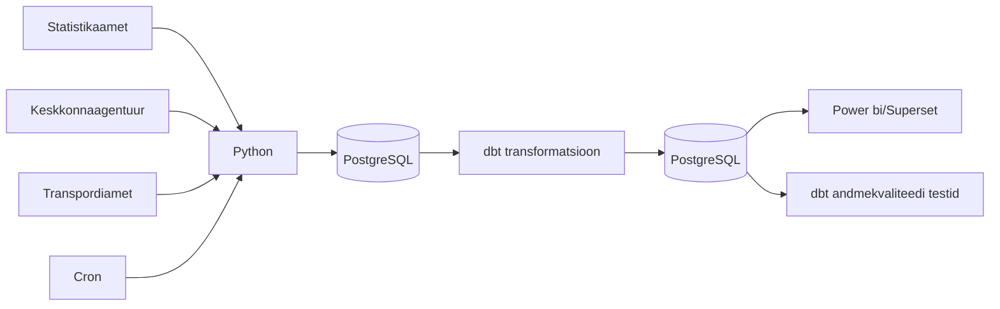

# Ilmastikutingimuste mõju surmajuhtumitele ja liiklusõnnetustele Eestis — Marta Bogatõr, Mark Robin Kalder, Heti Pisarev, Inge Ringmets

## Äriküsimus

Eesmärk on uurida kas ja kuidas iganädalane ilm (temperatuur, sademed ja tuul) on seotud surmajuhtude ja liiklusõnnetuste arvuga. Näiteks kas väga kuumade või väga külmade ilmadega on rohkem surmajuhte ja/või liiklusõnnetusi. Liiklusõnnetuste analüüsis on võimalik eristada ka maakonda.
Ilma mõju hindamiseks võrreldakse erinevate ilmastikutingimustega nädalaid omavahel. Vajadusel kasutatakse võrdlusperioodina varasemate aastate sama nädala keskmisi näitajaid.
Analüüs ei tõesta otsest põhjuslikku seost, vaid kirjeldab statistilisi seoseid ilmastikunäitajate, surmajuhtude ja liiklusõnnetuste vahel.

**Mõõdikud:**

1. Nädala keskmine temperatuur, päikesepaiste hulk + Ööpäeva keskmine temperatuur
  päikesepaiste kestus, grupeeritud aasta + nädal järgi
2. Äärmuslikud ilmastikutingimused
  Väga kuum päev = päev, mil maksimaalne temperatuur on üle 30°C
  Väga külm päev = päev, mil keskmine või minimaalne temperatuur jääb alla valitud lävendi, näiteks -10°C
3. Liiklusõnnetuste arv, vigastatute ja hukkunute arv ööpäevas maakondade lõikes
  liiklusõnnetus(valida gruppi), grupeeritud kuupäev + maakond järgi
4. Surmajuhtude arv nädalas vanuse lõikes
  surmade arv, grupeeritud aasta + nädal + vanuserühm järgi

## Arhitektuur



Täpsem kirjeldus: [`Docs/Arhitektuur.md`](docs/arhitektuur.md)


## Andmestik

| Allikas | Tüüp | Uuenemise sagedus | Roll | Link |
|---------|------|--------------|------|------|
| Statistikaamet RV035 | json | kord nädalas | Sisaldab **surmade arve** aasta, nädala, vanuserühma (0-64, 65-79, 80+) ja soo järgi. | https://andmed.stat.ee/et/stat/rahvastik__rahvastikusundmused__surmad/RV035/table/tableViewLayout2 |
| Keskkonnaportaal | json | kord tunnis | Sisaldab **ilmamõõtmisi** eestis tunni ja jaama kaupa | https://keskkonnaportaal.ee/et/avaandmed/keskkonna-ja-ilma-valdkonna-andmeteenused |
| Transpordiamet | csv | kord nädalas | sisaldab **liiklusõnnetusi**, osalejate arv, vigatsatud ja hukkunud inimesi, maakond | https://andmed.eesti.ee/datasets/inimkannatanutega-liiklusonnetuste-andmed |


## Stack

| Komponent | Tööriist |
|-----------|---------|
| Sissevõtt | [Python] |
| Transformatsioon | [SQL / dbt] |
| Andmehoidla | PostgreSQL |
| Näidikulaud | [Superset / Power bi] |
| Orkestreerimine | [CRON] |


# Ei ole tehtud:

## Käivitamine

```bash
# 1. Klooni repo ja liigu kausta
git clone <repo-url>
cd <projekti-kaust>

# 2. Kopeeri keskkonnamuutujad
cp .env.example .env
# Muuda .env failis paroolid ja muud seaded vastavalt vajadusele

# 3. Käivita teenused
docker compose up -d --build

# 4. [Vabatahtlik: käivita sissevõtt käsitsi esimesel korral]
# docker compose exec pipeline python scripts/run_pipeline.py run-all
```

Airflow (kui kasutatakse): http://localhost:8080 (kasutaja: airflow / parool: airflow)
Näidikulaud: http://localhost:[PORT]

## Saladused ja konfiguratsioon

Kõik saladused (paroolid, API võtmed, andmebaasi URL-id) on `.env` failis. Repos on ainult `.env.example`, mis näitab vajalike muutujate struktuuri ilma tegelike väärtusteta. Päris `.env` faili ei tohi GitHubi panna - see on `.gitignore`-s.

Vajalikud muutujad:

| Muutuja | Tähendus | Näide |
|---------|----------|-------|
| `DB_PASSWORD` | PostgreSQL parool | (saladus) |
| `[teised]` | ... | ... |

## Andmevoog lühidalt

1. **Sissevõtt** — [Kirjelda, kuidas andmed allikast kätte saadakse]

**onnetused**
   
| id |  kuupaev   |   kell   |    maakond    | omavalitsus | hukkunud | vigastatud |
|----|------------|----------|---------------|-------------|----------|------------|
|  1 | 2024-09-19 | 22:14:00 | Harju maakond | Saku vald   |        0 |          1|
 | 2 | 2023-07-22 | 05:06:00 | Harju maakond | Tallinn     |        0 |          1|
 | 3 | 2014-01-25 | 21:06:00 | Harju maakond | Tallinn     |        0 |          1|
|  4 | 2022-06-24 | 02:25:00 | Harju maakond | Tallinn     |        0 |          1|

**surmad**

| id |   Näitaja   |     Nädal     | Vaatlusperiood |      Sugu       |     Vanuserühm     |  value  |
|----|-------------|---------------|----------------|-----------------|--------------------|---------|
|  1 | Surmade arv | Nädalad kokku | 2017           | Mehed ja naised | Vanuserühmad kokku | 15476.0 |
|  2 | Surmade arv | Nädalad kokku | 2017           | Mehed ja naised | 0-64               | 3095.0 |
|  3 | Surmade arv | Nädalad kokku | 2017           | Mehed ja naised | 65-79              | 4945.0 |
|  4 | Surmade arv | Nädalad kokku | 2017           | Mehed ja naised | 80 ja vanemad      | 7436.0 |

**ilm**

| id | jaam_kood | jaam_nimi | aasta | kuu | paev | vaartus | element_kood |           element_nimi_eng            | element_yhik_eng |           avaandmed_ts           |
|----|-----------|-----------|-------|-----|------|---------|--------------|---------------------------------------|------------------|----------------------------------|
|  1 | AJJOGE01  | Jõgeva    | 2015  | 1   | 1    | 1010.9  | DPA008       | Air pressure at sea level (daily avg) | hPa              | 2024-01-15T09:42:45.506376+02:00|
|  2 | AJJOGE01  | Jõgeva    | 2015  | 1   | 2    | 991.9   | DPA008       | Air pressure at sea level (daily avg) | hPa              | 2024-01-15T09:42:45.506465+02:00|
|  3 | AJJOGE01  | Jõgeva    | 2015  | 1   | 3    | 979.1   | DPA008       | Air pressure at sea level (daily avg) | hPa              | 2024-01-15T09:42:45.506512+02:00|
|  4 | AJJOGE01  | Jõgeva    | 2015  | 1   | 4    | 988.5   | DPA008       | Air pressure at sea level (daily avg) | hPa              | 2024-01-15T09:42:45.506555+02:00|

3. **Laadimine** — Andmed laaditakse `staging` kihti
4. **Transformatsioon** — [Kirjelda peamised arvutused ja mudelid]
  - liiklusõnnetuste andmed "onnetused" -- tuleb õnnetuste kuupäevad jagada nädalateks ja lugeda iga aasta ja nädala kohta kokku liiklusõnnetuste arv, hukkunute arv ja vigastatute arv    
  - surmade andmed "surmad" -- alles jäävad read, kus "Näitaja" = 'Surmade arv' & "Nädalad" <> 'Nädalad kokku'. Sin tuleb tähele panna et need nädalad aastal 2026, mis pole veel kätte jäudnud on tabelis olemas, aga sisaldavad NaN ja teevad summeerimise sassi.
    
  - ilma andmed "ilm" -- veerus "element_nimi_eng" tuleb välja korjata meile meelepärased näitajad ja ajada õigete ajavahemike järgi kokku.  Seal on olemas  Air pressure at sea level (daily avg),  Air temperature (daily avg),  Air temperature (daily max),  Air temperature (daily min),  Global radiation (daily sum),  Precipitation (daily sum),  Relative humidity (daily avg),  Snow depth (at 06:00UTC),  Sunshine duration (daily sum),  Wind gust (daily max),  Wind speed (daily avg). Saame mõelda, mida täoselt vaja.
  
5. **Testimine** — [Mitu] andmekvaliteedi testi kontrollivad korrektsust
6. **Näidikulaud** — [Kirjelda lühidalt, mida näidikulaud näitab]

## Andmekvaliteedi testid

Projekt kontrollib järgmist:

1. [Test 1 - nt: kasutajate ID on unikaalne]
2. [Test 2 - nt: tellimuse summa pole null]
3. [Test 3 - nt: kuupäev jääb vahemikku 2020-2026]
[Lisa rohkem, kui sul on]

Testide tulemused: [kuhu salvestatakse / kuidas vaadata]

## Projekti struktuur

```
.
├── README.md
├── compose.yml
├── .env.example
├── .gitignore
├── docs/
│   ├── arhitektuur.md      ← nädal 1 väljund
│   └── progress.md         ← nädal 2 väljund
└── ...                     ← ülejäänud projektifailid
```

## Kokkuvõte, puudused ja võimalikud edasiarendused

**Kokkuvõte:**
- [Loetle, mis on lõpule viidud, mis töötab hästi]

**Puudused:**
- [Loetle ausalt, mis jäi tegemata - see ei mõjuta hinnet negatiivselt, vaid aitab hinnata]

**Mis edasi:**
- [Mida tahaksid edasi teha, kui aega oleks rohkem]

## Meeskond

| Nimi | Roll |
|------|------|
| [Marta Bogatõr] | [Roll] |
| [Nimi 2] | [Roll] |
| [Nimi 3] | [Roll] |
| [Nimi 4] | [Roll — vabatahtlik] |
