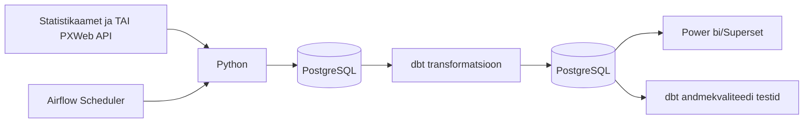

# Kas perearstiabi võimekus peab sammu rahvastiku vananemisega Eestis? — Marta Bogatõr, Mark Robin Kalder, Heti Pisarev, Inge Ringmets

## Äriküsimus

Eesmärk on uurida kuidas rahvastiku vananemine mõjutab perearstiabi koormust ja kättesaadavust Eesti maakondades. Analüüsist saavad kasu tervishoiu planeerijad, kohalikud omavalitsused ja otsustajad, kes peavad tuvastama piirkonnad, kus perearstiabile avalduv surve kasvab kõige kiiremini ning kus võib olla vaja lisarahastust, personali või teenuste ümberkorraldamist.

**Mõõdikud:**

1. 65+ elanike osakaal maakonnas
2. Perearstide arv 100 000 elaniku kohta
3. Visiidid ühe perearsti kohta

_**Püüame eesmärgi natuke konkreetsemaks saada**_
Meil on olemas 
* aasta, maakond
* 65+ rahvastiku osakaal per 100 000
* perearsti kontaktide arv (per maakond ja aasta)
* täidetud perearsti / õe ametikohtade arv per 100 000

Saame esitada:
* 65+ rahvastiku muutuse ajas
* PA kontaktide arvu muutuse ajas
* pereratsi ametikohtade arvu ajas (PA arv sõltu elanike arvust, mitte vanainimeste arvus)

## Arhitektuur



Täpsem kirjeldus: [`Docs/Arhitektuur.md`](docs/arhitektuur.md)


## Andmestik

| Allikas | Tüüp | Ajas muutuv? | Roll |
|---------|------|--------------|------|
| Statistikaamet RV022U | PXWeb API | Uueneb regulaarselt, aga harva (kord poole aasta või aasta jooksul) | Rahvastiku vanusstruktuuri analüüsimiseks. |
| TAI THT009 | PXWeb API | Uueneb regulaarselt, aga harva (kord poole aasta või aasta jooksul) | Perearstiabi võimekuse hindamiseks. |
| TAI AV40 | PXWeb API | Uueneb regulaarselt, aga harva (kord poole aasta või aasta jooksul) | Perearstiabi tegeliku koormuse mõõtmiseks |

Kui jõuame, siis lisaks:
| Allikas | Tüüp | Ajas muutuv? | Roll |
|---------|------|--------------|------|
| Statistikaamet RV084 | PXWeb API | Jah, aga prognoosiandmed uuenevad harva | Lisaanalüüs rahvastiku vananemise tulevikuprognoosi jaoks |

## Stack

| Komponent | Tööriist |
|-----------|---------|
| Sissevõtt | [Python] |
| Transformatsioon | [SQL / dbt] |
| Andmehoidla | PostgreSQL |
| Näidikulaud | [Superset / Power bi] |
| Orkestreerimine | [Airflow] |


# Ei ole tehtud:

## Käivitamine

```bash
# 1. Klooni repo ja liigu kausta
git clone <repo-url>
cd <projekti-kaust>

# 2. Kopeeri keskkonnamuutujad
cp .env.example .env
# Muuda .env failis paroolid ja muud seaded vastavalt vajadusele

# 3. Käivita teenused
docker compose up -d --build

# 4. [Vabatahtlik: käivita sissevõtt käsitsi esimesel korral]
# docker compose exec pipeline python scripts/run_pipeline.py run-all
```

Airflow (kui kasutatakse): http://localhost:8080 (kasutaja: airflow / parool: airflow)
Näidikulaud: http://localhost:[PORT]

## Saladused ja konfiguratsioon

Kõik saladused (paroolid, API võtmed, andmebaasi URL-id) on `.env` failis. Repos on ainult `.env.example`, mis näitab vajalike muutujate struktuuri ilma tegelike väärtusteta. Päris `.env` faili ei tohi GitHubi panna - see on `.gitignore`-s.

Vajalikud muutujad:

| Muutuja | Tähendus | Näide |
|---------|----------|-------|
| `DB_PASSWORD` | PostgreSQL parool | (saladus) |
| `[teised]` | ... | ... |

## Andmevoog lühidalt

1. **Sissevõtt** — [Kirjelda, kuidas andmed allikast kätte saadakse]

**onnetused**
   
| id |  kuupaev   |   kell   |    maakond    | omavalitsus | hukkunud | vigastatud |
|----|------------|----------|---------------|-------------|----------|------------|
|  1 | 2024-09-19 | 22:14:00 | Harju maakond | Saku vald   |        0 |          1|
 | 2 | 2023-07-22 | 05:06:00 | Harju maakond | Tallinn     |        0 |          1|
 | 3 | 2014-01-25 | 21:06:00 | Harju maakond | Tallinn     |        0 |          1|
|  4 | 2022-06-24 | 02:25:00 | Harju maakond | Tallinn     |        0 |          1|

**surmad**

| id |   Näitaja   |     Nädal     | Vaatlusperiood |      Sugu       |     Vanuserühm     |  value  |
|----|-------------|---------------|----------------|-----------------|--------------------|---------|
|  1 | Surmade arv | Nädalad kokku | 2017           | Mehed ja naised | Vanuserühmad kokku | 15476.0 |
|  2 | Surmade arv | Nädalad kokku | 2017           | Mehed ja naised | 0-64               | 3095.0 |
|  3 | Surmade arv | Nädalad kokku | 2017           | Mehed ja naised | 65-79              | 4945.0 |
|  4 | Surmade arv | Nädalad kokku | 2017           | Mehed ja naised | 80 ja vanemad      | 7436.0 |

**ilm**

| id | jaam_kood | jaam_nimi | aasta | kuu | paev | vaartus | element_kood |           element_nimi_eng            | element_yhik_eng |           avaandmed_ts           |
|----|-----------|-----------|-------|-----|------|---------|--------------|---------------------------------------|------------------|----------------------------------|
|  1 | AJJOGE01  | Jõgeva    | 2015  | 1   | 1    | 1010.9  | DPA008       | Air pressure at sea level (daily avg) | hPa              | 2024-01-15T09:42:45.506376+02:00|
|  2 | AJJOGE01  | Jõgeva    | 2015  | 1   | 2    | 991.9   | DPA008       | Air pressure at sea level (daily avg) | hPa              | 2024-01-15T09:42:45.506465+02:00|
|  3 | AJJOGE01  | Jõgeva    | 2015  | 1   | 3    | 979.1   | DPA008       | Air pressure at sea level (daily avg) | hPa              | 2024-01-15T09:42:45.506512+02:00|
|  4 | AJJOGE01  | Jõgeva    | 2015  | 1   | 4    | 988.5   | DPA008       | Air pressure at sea level (daily avg) | hPa              | 2024-01-15T09:42:45.506555+02:00|

3. **Laadimine** — Andmed laaditakse `staging` kihti
4. **Transformatsioon** — [Kirjelda peamised arvutused ja mudelid]
  - liiklusõnnetuste andmed "onnetused" -- tuleb õnnetuste kuupäevad jagada nädalateks ja lugeda iga aasta ja nädala kohta kokku liiklusõnnetuste arv, hukkunute arv ja vigastatute arv    
  - surmade andmed "surmad" -- alles jäävad read, kus "Näitaja" = 'Surmade arv' & "Nädalad" <> 'Nädalad kokku'
  - ilma andmed "ilm" -- veerus "element_nimi_eng" tuleb välja korjata meile meelepärased näitajad ja ajada õigete ajavahemike järgi kokku.  Seal on olemas  Air pressure at sea level (daily avg),  Air temperature (daily avg),  Air temperature (daily max),  Air temperature (daily min),  Global radiation (daily sum),  Precipitation (daily sum),  Relative humidity (daily avg),  Snow depth (at 06:00UTC),  Sunshine duration (daily sum),  Wind gust (daily max),  Wind speed (daily avg). Saame mõelda, mida täoselt vaja.
  
5. **Testimine** — [Mitu] andmekvaliteedi testi kontrollivad korrektsust
6. **Näidikulaud** — [Kirjelda lühidalt, mida näidikulaud näitab]

## Andmekvaliteedi testid

Projekt kontrollib järgmist:

1. [Test 1 - nt: kasutajate ID on unikaalne]
2. [Test 2 - nt: tellimuse summa pole null]
3. [Test 3 - nt: kuupäev jääb vahemikku 2020-2026]
[Lisa rohkem, kui sul on]

Testide tulemused: [kuhu salvestatakse / kuidas vaadata]

## Projekti struktuur

```
.
├── README.md
├── compose.yml
├── .env.example
├── .gitignore
├── docs/
│   ├── arhitektuur.md      ← nädal 1 väljund
│   └── progress.md         ← nädal 2 väljund
└── ...                     ← ülejäänud projektifailid
```

## Kokkuvõte, puudused ja võimalikud edasiarendused

**Kokkuvõte:**
- [Loetle, mis on lõpule viidud, mis töötab hästi]

**Puudused:**
- [Loetle ausalt, mis jäi tegemata - see ei mõjuta hinnet negatiivselt, vaid aitab hinnata]

**Mis edasi:**
- [Mida tahaksid edasi teha, kui aega oleks rohkem]

## Meeskond

| Nimi | Roll |
|------|------|
| [Marta Bogatõr] | [Roll] |
| [Nimi 2] | [Roll] |
| [Nimi 3] | [Roll] |
| [Nimi 4] | [Roll — vabatahtlik] |
