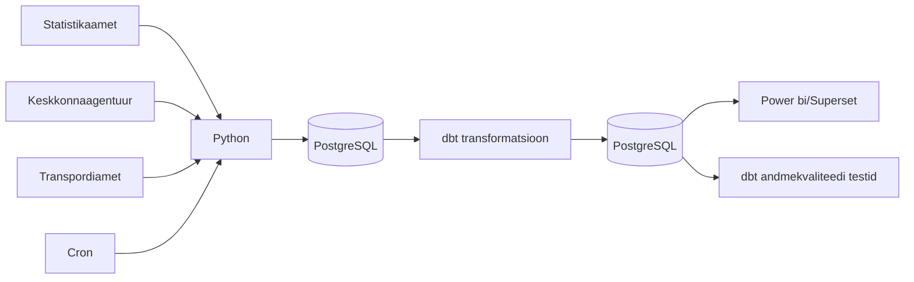

# Ilmastikutingimuste mõju surmajuhtumitele ja liiklusõnnetustele Eestis — Marta Bogatõr, Mark Robin Kalder, Heti Pisarev, Inge Ringmets

## Äriküsimus

Eesmärk on uurida, kas ja kuidas on ilm (temperatuur, sademed ja tuul) seotud surmajuhtude ja liiklusõnnetuste arvuga. Näiteks kas väga kuumade või väga külmade ilmadega on rohkem surmajuhte ja/või liiklusõnnetusi. Surmajuhtumeid saab analüüsida ka vanuserühmiti, liiklusõnnetusi maakonniti või piirkonniti.
Ilma "mõju" hindamiseks võrreldakse erinevate ilmastikutingimustega nädalaid. Vajadusel kasutatakse võrdlusperioodina varasemate aastate sama nädala keskmisi näitajaid.
Analüüs ei otsi ega tõesta põhjuslikke seoseid, vaid kirjeldab statistilisi seoseid ilmastikunäitajate, surmajuhtude ja liiklusõnnetuste vahel.

**Mõõdikud:**

1.Liiklusõnnetuste arv, vigastatute ja hukkunute arv ööpäevas maakondade lõikes
  liiklusõnnetus(valida gruppi), grupeeritud nädal + maakond järgi
  
2. Surmajuhtude arv nädalas - surnud inimeste arv ühes nädalas, vanuserühmiti ja maakonniti või piirkonniti Nädala keskmine temperatuur grupeeritud aasta + nädal järgi
   
3. Äärmuslikud ilmastikutingimused
  Soe nädal – nädal, kus keskmine temperatuur oli vähemalt 18 °C.
  Külm nädal – nädal, kus keskmine temperatuur oli -5 °C või madalam.
  Väga päikeseline nädal – nädal, kus päikesepaiste kestus oli vähemalt 80 tundi.
  Päikeseline nädal – nädal, kus päikesepaiste kestus oli vähemalt 60 tundi.
  Väga sajune nädal – nädal, kus sademete kogus oli vähemalt 100 mm.
  Sajune nädal – nädal, kus sademete kogus oli vähemalt 30 mm.
  Väga kuum nädal – nädal, kus esines vähemalt üks päev maksimaalse temperatuuriga üle 30 °C.
  Väga külm nädal – nädal, kus esines vähemalt üks päev minimaalse temperatuuriga alla -10 °C.
  Tavaline nädal – nädal, mis ei vastanud ühelegi eelnevale eritingimusele.

## Arhitektuur



Täpsem kirjeldus: [`Docs/Arhitektuur.md`](docs/arhitektuur.md)


## Tööriistad

| Komponent | Tööriist | Konteiner |
|-----------|---------|---------|
| Toorandmete sissevõtt | Python | `python` |
| Andmetorude orkestreerimine | CRON | `orchestrator` |
| Transformatsioon | SQL / dbt | `dbt` |
| Andmehoidla | PostgreSQL | `db` |
| Näidikulaud andmete visualiseerimiseks | Superset | `superset` |


## Andmevoog lühidalt

1. [Toorandmete sissevõtt](https://github.com/MarthaBog/Data-engineer-project-TU/blob/main/README.md#toorandmete-sissev%C3%B5tt)
2. [Andmetorude orkestreerimine](https://github.com/MarthaBog/Data-engineer-project-TU/blob/main/README.md#andmetorude-orkestreerimine)
3. [Transformatsioon](https://github.com/MarthaBog/Data-engineer-project-TU/blob/main/README.md#dbt-transformatsioonikiht)
4. [Testimine](https://github.com/MarthaBog/Data-engineer-project-TU/blob/main/README.md#andmekvaliteedi-testid)
5. [Näidikulaud](https://github.com/MarthaBog/Data-engineer-project-TU/blob/main/README.md#n%C3%A4idikulaud)


## Projekti struktuur

```
.
├── README.md                     ← projekti üldine kirjeldus ja kasutusjuhend
├── compose.yml                   ← Docker Compose, mis käivitab kogu andmetoru teenused
├── .dockerignore                 ← defineerib peidetud failid
├── .env.example                  ← keskkonnamuutujate e "saladuste" fail projekti käivitamiseks
├── .gitignore                    ← defineerib peidetud failid GitHubi jaoks
├── dbt_project.yml               ← dbt projekti konfiguratsioon ja mudelite struktuur
├── profiles.yml                  ← dbt ühenduse seadistus PostgreSQL andmebaasiga
├── dbt-requirements.txt          ← dbt konteineri Python sõltuvused
├── superset_config.py            ← Superseti seadistus
│
├── docker/
│   └── dbt.Dockerfile            ← ehitab dbt tööks vajaliku konteineri
│   └── superset.Dockerfile       ← ehitab Supersetile vajaliku konteineri 
│
├── macros/                       ← dbt makrod korduvate SQL‑loogikate jaoks
│
├── models/
│   ├── staging/                  ← toorandmete puhastamine
│   ├── intermediate/             ← äriloogikale vajaliku granulaarsuse tekitamine
│   └── marts/                    ← lõppmudelid analüütika ja Superseti jaoks
│
├── orchestrator/
│   ├── crontab                   ← ajastuse sageduse seadistamine
│   ├── Dockerfile                ← ehitab orkestreerimise jaoks vajaliku konteineri
│   ├── orchkestrator.py          ← töövoo juhtija, mis käivitab skriptid ja dbt transformatsioonid
│   └── run.sh                    ← konteineri käivitusskript orkestreerija käivitamiseks
│
├── seeds/                        ← dbt seed‑failid (staatilised CSV‑andmed)
│
├── docs/
│   ├── arhitektuur.md            ← nädala 1 väljund: süsteemi arhitektuuri kirjeldus
│   └── progress.md               ← nädala 2 väljund: projekti edenemise ülevaade
│
├── scripts/
|   ├── Dockerfile                ← ehitab pythoni konteineri
|   ├── download_*.py             ← andmete allalaadimise skriptid
|   ├── entrypoint.sh             ← skriptikonteineri käivitusskript
|   └── requirements.txt          ← Python sõltuvused andmete allalaadimise skriptidele
|
└── superset_exports/             ← Superseti näidikulaua eksportfailid (JSON)

```

## Toorandmete sissevõtt

| Andmebaasi tabeli nimi | Allikas | Tüüp | Allika uuenemise sagedus | Link |
|-------------|---------|-------|--------------|------|
| surmad | Statistikaamet RV035 - sisaldab **surmade arve** aasta, nädala, vanuserühma (0-64, 65-79, 80+) | json | kord nädalas | [Surmad](https://andmed.stat.ee/et/stat/rahvastik__rahvastikusundmused__surmad/RV035/table/tableViewLayout2) |
| ilm | Keskkonnaportaal - sisaldab **ilmamõõtmisi** Eestis tunni ja jaama kaupa | json | kord tunnis | [Ilmastikunähtused](https://keskkonnaportaal.ee/et/avaandmed/keskkonna-ja-ilma-valdkonna-andmeteenused) |
| onnetused | Transpordiamet - sisaldab **liiklusõnnetusi**, nendes vigastatute ja hukkunute arvu maakonniti | csv | kord nädalas | [Liiklusõnnetused](https://andmed.eesti.ee/datasets/inimkannatanutega-liiklusonnetuste-andmed) |

**Liikluse andmed**
Skript _download_liiklus.py_ pärib Maanteeameti liiklusõnnetuste API-st värsked liiklusõnnetuste kirjed.
Saadud JSON andmed teisendatakse ridade kaupa ning kirjutatakse PostgreSQL tabelisse .
Skript tagab, et uued andmed lisatakse olemasolevatele, vältides duplikaate.

**Surmad**
Skript _download_surm.py_ laeb alla Statistikaameti API-st surmade statistika (vanus, sugu, põhjus).
Andmed puhastatakse ja normaliseeritakse ning seejärel salvestatakse PostgreSQL andmebaasi tabelisse surmad.
Skript on osa automaatsest ETL protsessist, mis tagab, et surmaandmed on alati ajakohased.

**Ilma andmed**
Skript _download_ilm.py_ laadib alla Eesti Ilmateenistuse API-st ilmaandmed (temperatuur, sademed, tuul) JSON-formaadis.
Andmed parsitakse sobivasse struktuuri ja salvestatakse PostgreSQL andmebaasi tabelisse, kasutades SQL INSERT käske.
Skript käivitub automaatselt pipeline’i osana ja uuendab andmeid perioodiliselt.

## Andmetorude orkestreerimine

Toimub konteineris _orchestrator_, mis käivitab kogu ETL‑protsessi automaatselt pärast Docker Compose’i ülesehitamist. Orkestreerija käivitab esmalt andmete laadimise skriptid, mis toovad toorandmed ja salvestavad need PostgreSQL andmebaasi. Kui kõik toorandmed on edukalt laetud, käivitab orkestreerija dbt transformatsioonid, mis loovad analüütilised tabelid ja vaated Superseti jaoks. Orkestreerimine tagab, et kõik ETL‑etapid toimuvad õiges järjekorras ning et transformatsioonid ei käivitu enne, kui andmebaas sisaldab värskeid toorandmeid.

## dbt transformatsioonikiht

Täpsem kirjeldus kihtidest, granulaarsustest, metoodikast ja piirangutest on failis [`docs/dbt_transformatsioonikiht.md`](docs/dbt_transformatsioonikiht.md).

dbt projekt loob transformatsioonikihi olemasolevate tabelite peale:
- `surmad`
- `onnetused`
- `ilm`

Olulised väljundid:
| Tabel | Kirjeldus |
|-------|-----------|
|- `fct_deaths_weekly` | Surmade arv nädalate kaupa soo ja vanuse järgi |
|- `fct_traffic_weekly_county` | Nädalane liiklusõnnetuste info maakondade järgi | 
|- `fct_weather_weekly_county` | Nädalane ilmainfo maakondades: temperatuur, sademed, tuul, päike | 
|- `mart_deaths_weather_weekly_national` | Analüüsitabel surmade ja ilma seose kirjeldamiseks |
|- `mart_traffic_weather_weekly_county` | Analüüsitabel liiklusõnnetuste ja ilma seose kirjeldamiseks |

Struktuur:
- `models/staging` puhastab ja seab paremad andmetüübid
- `models/intermediate` joondab granulaarsuse nädalale, jaamale ja maakonnale
- `models/marts` loob dimensioonid, faktitabelid ja lõppmardid
- `seeds` sisaldab maakondade ning ilmavaatlusjaamade staatilisi vastendusi

## Andmekvaliteedi testid

- Idempotentsus -- et taaskäivitamisel saame sama tulemuse ja et meil ei tekiks duplikaate. Lahendatud sellega, et iga käivituse alguses kututatakse toorandmed maha ja tehakse kogu protsess uuesti. 
- Vajalikud dimensioonid (nädalad, aastad, maakonnad, vanuserühmad ja sugu) ei sisaldaks tühje väärtusi.
- Vaatame andmetes miinimum- ja maksimumväärtusi, kas need on loogilised.

## Näidikulaud

Dashboard loodi Apache Supersetis ning selle eesmärk oli anda ülevaade võimalikest seostest kolme teema vahel: **ilmastikutingimused, liiklusõnnetused ja surmad Eestis**. Oluline on rõhutada, et analüüsi **eesmärk ei olnud tõestada põhjus-tagajärg seoseid**.See dashboard aitab pigem märgata mustreid ja võimalikke kokkulangevusi nende nähtuste vahel.

Andmeid vaadeldakse **aastate ja nädalate lõikes** ning lisaks on võimalik tulemusi filtreerida **soo, vanuse ja maakonna** järgi. Visualisatsioonide loetavuse parandamiseks ja lihtsustamiseks piirati kuvatav periood aastatega **2020–2026**. Ja ise dashboard-i jagati kaheks peamiseks teemaks: **Liiklusõnnetused ja ilmastikutingimused** ning **Surmad ja ilmastikutingimused**. Ülemisse ossa samuti lisati KPI-kaardid, mis annavad kiire ülevaate olulisematest näitajatest.

Filtrite kasutamisel tuleb arvestada, et visualisatsioonid põhinevad erinevatel tabelitel. Seetõttu ei mõjuta kõik filtrid kõiki graafikuid korraga. Näiteks maakonna filter rakendub ainult nendele visualisatsioonidele, mille aluseks olevas tabelis on maakonna tunnus olemas.


### Dashboardi loomise protsess

Töö alustamiseks avati Apache Superseti keskkond ning loodi vajalik kasutaja. Seejärel ühendati Superset projekti PostgreSQL-i andmebaasiga, mis võimaldas luua graafikuid varem ettevalmistatud mart-tabelite põhjal.

Ettevalmistatud andmete üldine struktuur ja mart-tabelid olid hästi tehtud ning pakkusid dashboardi loomiseks tugeva aluse. Aga töö käigus selgus siiski, et mart-tabeleid ei ole alati mõistlik otse kasutada. Osa vajalikke andmeid tuli ühendada viisil, mida olemasolevad mart-tabelid ei võimaldanud. Lisaks esines andmetes duplikaate, mille tõttu võisid agregeeritud näitajad kuvada valesid väärtusi.

Nende probleemide lahendamiseks loodi SQL Labis neli virtuaalset andmestikku. Need võimaldasid lisada arvutatavaid välju, määrata andmetele sobiva detailsustaseme ning vältida vigu agregeerimisel. Selline lähenemine muutis dashboardi ülesehituse selgemaks ja vähendas riski, et visualisatsioonides kuvatakse eksitavaid tulemusi.

## Käivitamine

```bash
# 1. Klooni repo ja liigu kausta
git clone https://github.com/MarthaBog/Data-engineer-project-TU
cd Data-engineer-project-TU

# 2. Kopeeri keskkonnamuutujad
cp .env.example .env

# 3. Käivita teenused (käivitab korraga ka transformatsioonid ja loob superseti jaoks sisendi)
docker compose up -d --build

(Käsitsi dbt transformatsioonide käivitamine-- pole eraldi vaja teha)
docker compose --profile dbt run --rm dbt seed
docker compose --profile dbt run --rm dbt run

# 4. Superseti avamiseks
Superset link (parool failis ".env")
http://localhost:8088

Supersetis avada:
**Settings → Database Connections → Ilm Surm Liiklus PostgreSQL → Edit**

Sisesta SQLAlchemy URI:
**postgresql://projekt:pass@db:5432/ilm_surm_liiklus**

Import dashboard:
Dashboards → Import → lisada zip-file kaustast "superset_exports"
```


## Saladused ja konfiguratsioon

Kõik saladused (paroolid, API võtmed, andmebaasi URL-id) on `.env` failis. Repos on ainult `.env.example`, mis näitab vajalike muutujate struktuuri ilma tegelike väärtusteta. Päris `.env` faili ei tohi GitHubi panna - see on `.gitignore`-s.


## Kokkuvõte, puudused ja võimalikud edasiarendused

**Kokkuvõte:**
Docker Compose käivitab kõik teenused
Projekt käivitub iga nädal 1x automaatselt
Andmed saadakse allikatest kätte
Transformatsioonid toimuvad staging, intermediate ja marts kihtides
Toimuvad andmekvaliteedikontrollid peale andmete transformeerimist
Olemas on Superseti nädikulaud

**Puudused:**
- Palju aega kulus sellele, et kõik meeskonnaliikmed proovisid töövooga kaasas käia. Kõige ajamahukamateks kujunesid Superseti töölesaamine ja ajastamise programmeerimine.
- Saladuste fail tuleb kästsi kopeerida, see ei toimu automaatselt koos projekti käivitamisega.
- Andmevaliteedi testid said tehtud kõige viimasena ja seega võib seal olla veel puudusi.

**Mis edasi:**
- Tuleks põhjalikumalt mõelda äriküsimuste sisukuse peale.
- Ajastamine toimub hetkel 1x nädalas kõikide toorandmete puhul korraga, aga võiks toimuda eraldi vastavalt iga algallika uuenemise sagedusele.

## Meeskond

| Roll | Vastutus | Täitja |
|------|----------|--------|
| Andmeallika omanik | Kirjutab sissevõtu loogika, hoiab API-t töös | Inge, Heti |
| Transformatsioonide omanik | Kirjutab mart kihi mudelid ja mõõdikute arvutuse | Mark |
| Kvaliteedi omanik | Kirjutab testid ja vaatab läbi ebaõnnestunud kontrollid | Mark |
| Ajastamise omanik | Sätib paika ajastamise | Inge, Heti |
| Näidikulaua omanik | Ehitab näidikulaua ja seob selle äriküsimusega | Marta |
