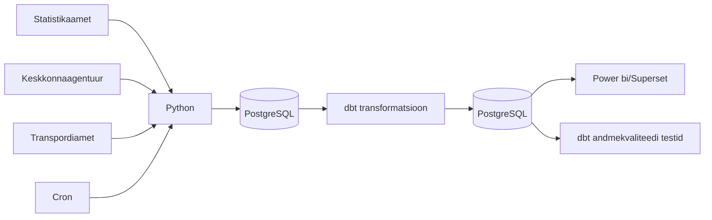

# Arhitektuur

## Äriküsimus  -- _seda osa on vaja vastavalt saadavatele andmeallikatele veidi kohendada_

Eesmärk on uurida kuidas igapäevane ilm (temperatuur, sademed ja tuul) on seotud päevaste (nädalaste?) surmajuhtude arvuga piirkondlikult  ja vanuserühmades. Näiteks kas väga kuumade või väga külmade ilmadega on rohkem surmajuhte. _Perearstide arvuga mingi seos?_
_Liiklusõnnetused transpordiametist?_

## Mõõdikud -- _tuleb lahti kirjutada valemite tasemel_

1. Surmajuhtude arv nädalas, saab eristada vanuserühmasid ((0-64, 65-79, 80+) ja sugu
2. Ööpäeva keskmine temperatuur, sademete hulk ja tuule kiirus
3. 65+ elanike osakaal piirkonnas
4. Surmajuhtude arv 10 000 elaniku kohta piirkonnas

## Andmeallikad -- _need tuleb üles otsida ja lisada uuenemise sagedus_

| Allikas | Tüüp | Ajas muutuv? | Roll | Link |
|---------|------|--------------|------|------|
| Statistikaamet RV035 | PXWeb API | Uueneb kord nädalas | Sisaldab **surmade arve** aasta, nädala, vanuserühma (0-64, 65-79, 80+) ja soo järgi. | https://andmed.stat.ee/et/stat/rahvastik__rahvastikusundmused__surmad/RV035/table/tableViewLayout2 |
| Keskkonnaportaal | | Uueneb kord tunnis | Sisaldab ilmamõõtmisi eestis tunni ja jaama kaupa | https://keskkonnaportaal.ee/et/avaandmed/keskkonna-ja-ilma-valdkonna-andmeteenused |
| Transpordiamet | segane veel | kord nädalas | sisaldab liiklusõnnetusi, osalevate autode arvu, hukkunud inimesi, asukohta jne | https://andmed.eesti.ee/datasets/inimkannatanutega-liiklusonnetuste-andmed |

Lisakraam: 
| Allikas | Tüüp | Ajas muutuv? | Roll | Link |
|---------|------|--------------|------|------|
| Statistikaamet RV022U | PXWeb API | Uueneb regulaarselt, aga harva (kord poole aasta või aasta jooksul) | Rahvastiku vanusstruktuuri analüüsimiseks. |
| TAI THT009 | PXWeb API | Uueneb regulaarselt, aga harva (kord poole aasta või aasta jooksul) | Perearstiabi võimekuse hindamiseks. |
| TAI AV40 | PXWeb API | Uueneb regulaarselt, aga harva (kord poole aasta või aasta jooksul) | Perearstiabi tegeliku koormuse mõõtmiseks |

Kui jõuame, siis lisaks:
| Allikas | Tüüp | Ajas muutuv? | Roll |
|---------|------|--------------|------|
| Statistikaamet RV084 | PXWeb API | Jah, aga prognoosiandmed uuenevad harva | Lisaanalüüs rahvastiku vananemise tulevikuprognoosi jaoks |

## Andmevoog  -- _see tuleks teha nii, et andmeallikad on eraldi kastides ja vata üle skeem loengust, kuidas cron, python ja andmeallikad olema peavad_

## Andmebaasi kihid

| Kiht | Roll |
|------|------|
| `Bronze staging` | Hoiab allikatest saadud andmeid võimalikult töötlemata kujul. Siia jõuavad PXWeb API vastustest laetud rahvastiku, ilma ja liiklusõnnetuste andmed. |
| `Silver intermediate` | Puhastab ja ühtlustab andmed, et erinevad allikad läheksid kokku ajaraamis (nädala või kuu kaupa), maakondade nimed, aastad, vanuserühmad jne viiakse samale kujule. |
| `Gold mart` | Hoiab transformeeritud ja äriloogikat sisaldavaid tabeleid, mida kasutatakse pärast dashboard'is. Siin arvutatakse näiteks: surmajuhtude arv, ööpäeva keskmine temperatuur, sademed ja tuulekiirus, 65+ elanike osakaal ja liiklusõnnetuste arv ühtses ajaperioodis. |

## Tööjaotus - OTSUSTADA

| Roll | Vastutus | Täitja |
|------|----------|--------|
| Andmeallika omanik | Kirjutab sissevõtu loogika, hoiab API-t töös | Inge, Heti |
| Transformatsioonide omanik | Kirjutab mart kihi mudelid ja mõõdikute arvutuse | Mark |
| Kvaliteedi omanik | Kirjutab testid ja vaatab läbi ebaõnnestunud kontrollid | Inge, Heti |
| Näidikulaua omanik | Ehitab näidikulaua ja seob selle äriküsimusega | Marta |

## Riskid

| Risk | Mõju | Maandus |
|------|------|---------|
| API struktuur või tabeli kood muutub | Python sissevõtu skript võib ebaõnnestuda või laadida valed andmed | Hoida allikate URL-id ja päringuparameetrid eraldi konfiguratsioonis ning lisada kontroll, kas oodatud veerud on olemas |
| Maakondade nimed või koodid ei ühti eri allikates | Andmeid ei saa korrektselt ühendada maakonna tasemel | Luua dimension table, kus maakondade nimed ja koodid standardiseeritakse |

## Privaatsus ja turve

Projekt kasutab avalikke koondandmeid Statistikaametist ja Keskkonnaagentuuirst ja Transpordiamet (_võibolla_). Andmed on esitatud maakonna ja aasta tasemel ning ei sisalda üksikisikute nimesid, isikukoode, aadresse ega muid otseseid isikuandmeid, seega ei ole projektis vaja isikuandmeid anonümiseerida. 
