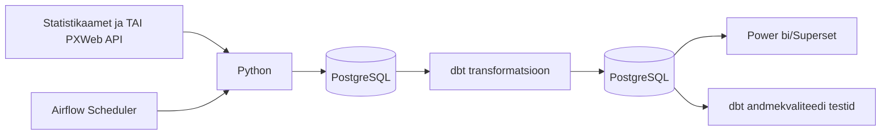

# Arhitektuur

## Äriküsimus

Eesmärk on uurida kuidas rahvastiku vananemine mõjutab perearstiabi koormust ja kättesaadavust Eesti maakondades. Analüüsist saavad kasu tervishoiu planeerijad, kohalikud omavalitsused ja otsustajad, kes peavad tuvastama piirkonnad, kus perearstiabile avalduv surve kasvab kõige kiiremini ning kus võib olla vaja lisarahastust, personali või teenuste ümberkorraldamist.

## Mõõdikud

1. 65+ elanike osakaal maakonnas
2. Perearstide arv 100 000 elaniku kohta
3. Visiidid ühe perearsti kohta

## Andmeallikad

| Allikas | Tüüp | Ajas muutuv? | Roll |
|---------|------|--------------|------|
| Statistikaamet RV022U | PXWeb API | Uueneb regulaarselt, aga harva (kord poole aasta või aasta jooksul) | Rahvastiku vanusstruktuuri analüüsimiseks. |
| TAI THT009 | PXWeb API | Uueneb regulaarselt, aga harva (kord poole aasta või aasta jooksul) | Perearstiabi võimekuse hindamiseks. |
| TAI AV40 | PXWeb API | Uueneb regulaarselt, aga harva (kord poole aasta või aasta jooksul) | Perearstiabi tegeliku koormuse mõõtmiseks |

Kui jõuame, siis lisaks:
| Allikas | Tüüp | Ajas muutuv? | Roll |
|---------|------|--------------|------|
| Statistikaamet RV084 | PXWeb API | Jah, aga prognoosiandmed uuenevad harva | Lisaanalüüs rahvastiku vananemise tulevikuprognoosi jaoks |

## Andmevoog

flowchart LR
    A1[Statistikaamet RV022U rahvastik vanuse järgi]
    A2[TAI THT009 perearstiabi võimekus]
    A3[TAI AV40 perearstiabi visiidid]
    A4[Statistikaamet RV084 rahvastikuprognoos]

    A1 --> B[Airflow DAG]
    A2 --> B
    A3 --> B
    A4 --> B

    B --> C[Python ETL PXWeb API päringud]
    C --> D[(PostgreSQL staging toorandmed)]
    D --> E[dbt staging models tüüpimine ja puhastus]
    E --> F[dbt intermediate models maakondade ja aastate ühtlustamine]
    F --> G[dbt marts star schema ja KPI tabelid]
    G --> H[dbt tests andmekvaliteedi kontroll]
    G --> I[Superset dashboard]
    G --> J[OpenMetadata lineage ja dokumentatsioon]

## Andmebaasi kihid

| Kiht | Roll |
|------|------|
| `Bronze staging` | Hoiab allikatest saadud andmeid võimalikult töötlemata kujul. Siia jõuavad PXWeb API vastustest laetud rahvastiku, perearstide ja visiitide andmed. |
| `Silver intermediate` | Puhastab ja ühtlustab andmed: maakondade nimed, aastad, vanuserühmad jne viiakse samale kujule. |
| `Gold mart` | Hoiab transformeeritud ja äriloogikat sisaldavaid tabeleid, mida kasutatakse pärast dashboard'is. Siin arvutatakse näiteks: 65+ elanike osakaal, perearstid 100 000 elaniku kohta ja visiidid ühe perearsti kohta. |

## Tööjaotus - OTSUSTADA

| Roll | Vastutus | Täitja |
|------|----------|--------|
| Andmeallika omanik | Kirjutab sissevõtu loogika, hoiab API-t töös | [Nimi] |
| Transformatsioonide omanik | Kirjutab mart kihi mudelid ja mõõdikute arvutuse | [Nimi] |
| Kvaliteedi omanik | Kirjutab testid ja vaatab läbi ebaõnnestunud kontrollid | [Nimi] |
| Näidikulaua omanik | Ehitab näidikulaua ja seob selle äriküsimusega | [Nimi] |

## Riskid

| Risk | Mõju | Maandus |
|------|------|---------|
| API struktuur või tabeli kood muutub | Python sissevõtu skript võib ebaõnnestuda või laadida valed andmed | Hoida allikate URL-id ja päringuparameetrid eraldi konfiguratsioonis ning lisada kontroll, kas oodatud veerud on olemas |
| Maakondade nimed või koodid ei ühti eri allikates | Andmeid ei saa korrektselt ühendada maakonna tasemel | Luua dimension table, kus maakondade nimed ja koodid standardiseeritakse |

## Privaatsus ja turve

### **[Kirjelda, millised isiku- või tundlikud andmed teie projektis esinevad (kui üldse) ja kuidas neid kaitsete. Isikuandmed peavad olema anonümiseeritud. Andmebaasi paroolid peavad tulema `.env` failist.]**

Projekt kasutab avalikke koondandmeid Statistikaametist ja Tervise Arengu Instituudist. Andmed on esitatud maakonna ja aasta tasemel ning ei sisalda üksikisikute nimesid, isikukoode, aadresse ega muid otseseid isikuandmeid, seega ei ole projektis vaja isikuandmeid anonümiseerida. 

`.env` failist?