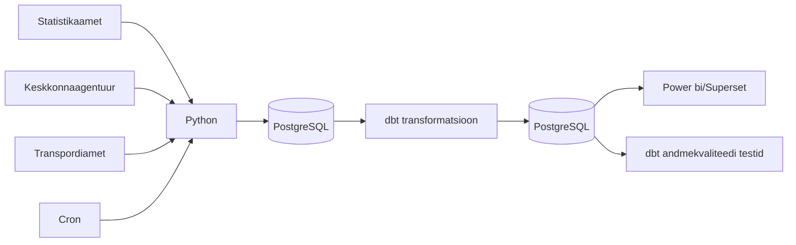

# Arhitektuur

## Äriküsimus

**NB! Kuna Algselt planeeritud andmed olid liiga staatilised, siis muutsime teemat**

Uus eesmärk on uurida, kas ja kuidas on ilm (temperatuur, sademed ja tuul) seotud surmajuhtude ja liiklusõnnetuste arvuga. Näiteks kas väga kuumade või väga külmade ilmadega on rohkem surmajuhte ja/või liiklusõnnetusi. Surmajuhtumeid saab analüüsida ka vanuserühmiti, liiklusõnnetusi maakonniti või piirkonniti.
Ilma "mõju" hindamiseks võrreldakse erinevate ilmastikutingimustega nädalaid. Vajadusel kasutatakse võrdlusperioodina varasemate aastate sama nädala keskmisi näitajaid.
Analüüs ei otsi ega tõesta põhjuslikke seoseid, vaid kirjeldab statistilisi seoseid ilmastikunäitajate, surmajuhtude ja liiklusõnnetuste vahel.

## Mõõdikud 
(ilmselt täpsustuvad veel töö käigus, sh valemid mõõdikute arvutamiseks, mis peamiselt on summad ja keskmised üle nädalase ajaperioodi)

1. Nädala keskmine temperatuur, päikesepaiste hulk ja sadmete hulk
2. Äärmuslikud ilmastikutingimused:
   - Väga kuum päev = päev, mil maksimaalne temperatuur on üle 30°C
   - Väga külm päev = päev, mil keskmine või minimaalne temperatuur jääb alla valitud lävendi, näiteks -10°C
3. Liiklusõnnetuste, vigastatute ja hukkunute arv nädalas maakonniti või piirkonniti
4. Surmajuhtude arv nädalas vanuserühmiti

 
## Andmeallikad

| Allikas | Tüüp | Uuenemise sagedus | Roll | Link |
|---------|------|--------------|------|------|
| Statistikaamet RV035 | json | kord nädalas | Sisaldab **surmade arve** aasta, nädala, vanuserühma (0-64, 65-79, 80+) ja soo kaupa | [Surmad](https://andmed.stat.ee/et/stat/rahvastik__rahvastikusundmused__surmad/RV035/table/tableViewLayout2) |
| Keskkonnaportaal | json | kord tunnis | Sisaldab **ilmamõõtmisi** Eestis tunni ja jaama kaupa | [Ilmastikunähtused](https://keskkonnaportaal.ee/et/avaandmed/keskkonna-ja-ilma-valdkonna-andmeteenused) |
| Transpordiamet | csv | kord nädalas | sisaldab **liiklusõnnetusi**, nendes vigastatute ja hukkunute arvu maakonniti | [Liiklusõnnetused](https://andmed.eesti.ee/datasets/inimkannatanutega-liiklusonnetuste-andmed) |

## Andmevoog

## Andmebaasi kihid

| Kiht | Roll |
|------|------|
| `Bronze staging` | Hoiab allikatest saadud andmeid võimalikult töötlemata kujul. Siia jõuavad PXWeb API vastustest laetud rahvastiku, ilma ja liiklusõnnetuste andmed. |
| `Silver intermediate` | Puhastab ja ühtlustab andmed, et erinevad allikad läheksid kokku ajaraamis (nädala või kuu kaupa), maakondade nimed, aastad, vanuserühmad jne viiakse samale kujule. |
| `Gold mart` | Hoiab transformeeritud ja äriloogikat sisaldavaid tabeleid, mida kasutatakse pärast *dashboard*is. Siin arvutatakse näiteks surmajuhtude arv, nädala keskmine temperatuur, päikesepaiste hulk ja sademed, vanuserühmad ja liiklusõnnetuste ning vigastatute ja hukunute arvud ühtses ajaperioodis. |

## Tööjaotus

| Roll | Vastutus | Täitja |
|------|----------|--------|
| Andmeallika omanik | Kirjutab sissevõtu loogika, hoiab API-t töös | Inge, Heti |
| Transformatsioonide omanik | Kirjutab mart kihi mudelid ja mõõdikute arvutuse | Mark |
| Kvaliteedi omanik | Kirjutab testid ja vaatab läbi ebaõnnestunud kontrollid | Inge, Heti |
| Näidikulaua omanik | Ehitab näidikulaua ja seob selle äriküsimusega | Marta |

## Riskid

| Risk | Mõju | Maandus |
|------|------|---------|
| API struktuur või tabeli kood muutub | Pythoni skript võib ebaõnnestuda või laadida valed/vigased andmed | Hoida allikate URL-id ja päringu parameetrid eraldi konfiguratsioonis ning lisada kontroll, kas oodatud veerud on olemas |
| Maakondade või vanuserühmade nimed või koodid ei ühti eri allikates | Andmeid ei saa korrektselt ühendada maakonna või vanuserühma tasemel | Luua *dimension table*, kus maakondade ja vanuserühmade nimed ja koodid standarditakse |

## Privaatsus ja turve

Projekt kasutab statistikaameti, keskkonnaagentuuri ja transpordiameti avalikke andmeid. Andmed on kas agregeeritud või ei sisalda inimeste nimesid, isikukoode, aadresse ega muid isikuandmeid, seega ei ole projektis vaja isikuandmeid anonümiseerida. 
