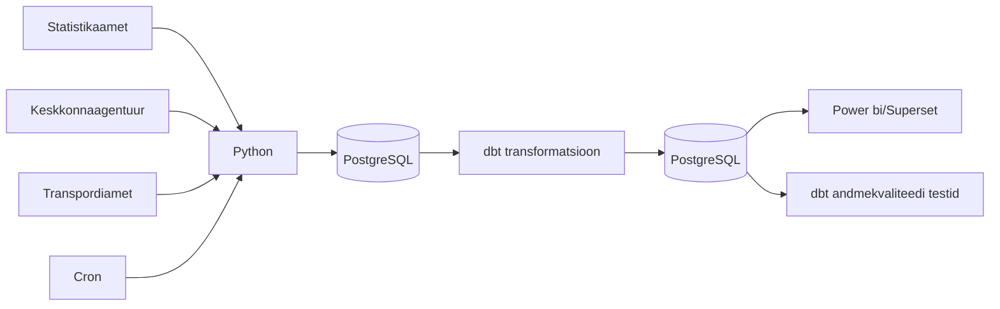

# Arhitektuur

## Äriküsimus

**NB! Kuna Algselt planeeritud andmed olid liiga staatilised, siis muutsime teemat**

Uus eesmärk on uurida, kas ja kuidas ilm (temperatuur, sademed ja tuul) on seotud surmajuhtude ja liiklusõnnetuste arvuga. Näiteks kas väga kuumade või väga külmade ilmadega on rohkem surmajuhte ja/või liiklusõnnetusi. Liiklusõnnetuste analüüsis on võimalik eristada ka maakonda.
Ilma mõju hindamiseks võrreldakse erinevate ilmastikutingimustega nädalaid omavahel. Vajadusel kasutatakse võrdlusperioodina varasemate aastate sama nädala keskmisi näitajaid.
Analüüs ei tõesta otsest põhjuslikku seost, vaid kirjeldab statistilisi seoseid ilmastikunäitajate, surmajuhtude ja liiklusõnnetuste vahel.

## Mõõdikud (ilmselt täpsustuvad veel töö käigus, sh valemid mõõdikute arvutamiseks)

1. Nädala keskmine temperatuur, päikesepaiste hulk ja sadmete hulk
2. Äärmuslikud ilmastikutingimused:
   - Väga kuum päev = päev, mil maksimaalne temperatuur on üle 30°C
   - Väga külm päev = päev, mil keskmine või minimaalne temperatuur jääb alla valitud lävendi, näiteks -10°C
3. Liiklusõnnetuste, vigastatute ja hukkunute arv nädalas maakonniti või piirkonniti
4. Surmajuhtude arv nädalas vanuserühmiti

 
## Andmeallikad

| Allikas | Tüüp | Uuenemise sagedus | Roll | Link |
|---------|------|--------------|------|------|
| Statistikaamet RV035 | json | kord nädalas | Sisaldab **surmade arve** aasta, nädala, vanuserühma (0-64, 65-79, 80+) ja soo kaupa | https://andmed.stat.ee/et/stat/rahvastik__rahvastikusundmused__surmad/RV035/table/tableViewLayout2 |
| Keskkonnaportaal | json | kord tunnis | Sisaldab **ilmamõõtmisi** Eestis tunni ja jaama kaupa | https://keskkonnaportaal.ee/et/avaandmed/keskkonna-ja-ilma-valdkonna-andmeteenused |
| Transpordiamet | csv | kord nädalas | sisaldab **liiklusõnnetusi**, nendes vigastatute ja hukkunute arvu maakonniti | https://andmed.eesti.ee/datasets/inimkannatanutega-liiklusonnetuste-andmed |

## Andmevoog

## Andmebaasi kihid

| Kiht | Roll |
|------|------|
| `Bronze staging` | Hoiab allikatest saadud andmeid võimalikult töötlemata kujul. Siia jõuavad PXWeb API vastustest laetud rahvastiku, ilma ja liiklusõnnetuste andmed. |
| `Silver intermediate` | Puhastab ja ühtlustab andmed, et erinevad allikad läheksid kokku ajaraamis (nädala või kuu kaupa), maakondade nimed, aastad, vanuserühmad jne viiakse samale kujule. |
| `Gold mart` | Hoiab transformeeritud ja äriloogikat sisaldavaid tabeleid, mida kasutatakse pärast dashboard'is. Siin arvutatakse näiteks: surmajuhtude arv, ööpäeva keskmine temperatuur, sademed ja tuulekiirus, 65+ elanike osakaal ja liiklusõnnetuste arv ühtses ajaperioodis. |

## Tööjaotus

| Roll | Vastutus | Täitja |
|------|----------|--------|
| Andmeallika omanik | Kirjutab sissevõtu loogika, hoiab API-t töös | Inge, Heti |
| Transformatsioonide omanik | Kirjutab mart kihi mudelid ja mõõdikute arvutuse | Mark |
| Kvaliteedi omanik | Kirjutab testid ja vaatab läbi ebaõnnestunud kontrollid | Inge, Heti |
| Näidikulaua omanik | Ehitab näidikulaua ja seob selle äriküsimusega | Marta |

## Riskid

| Risk | Mõju | Maandus |
|------|------|---------|
| API struktuur või tabeli kood muutub | Python sissevõtu skript võib ebaõnnestuda või laadida valed andmed | Hoida allikate URL-id ja päringuparameetrid eraldi konfiguratsioonis ning lisada kontroll, kas oodatud veerud on olemas |
| Maakondade nimed või koodid ei ühti eri allikates | Andmeid ei saa korrektselt ühendada maakonna tasemel | Luua dimension table, kus maakondade nimed ja koodid standardiseeritakse |

## Privaatsus ja turve

Projekt kasutab avalikke koondandmeid Statistikaametist ja Keskkonnaagentuuirst ja Transpordiamet (_võibolla_). Andmed on esitatud maakonna ja aasta tasemel ning ei sisalda üksikisikute nimesid, isikukoode, aadresse ega muid otseseid isikuandmeid, seega ei ole projektis vaja isikuandmeid anonümiseerida. 
